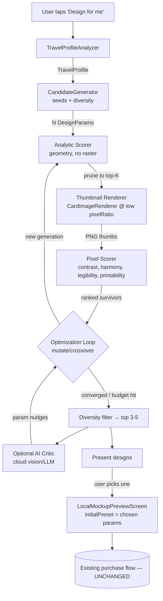

# Architecture — AI-Assisted T-Shirt Design Engine

**Status:** `proposed — awaiting review (do not implement yet)`
**Created:** 2026-07-28
**Owner:** merch / cards
**Related:** M187–M196 (configurator, print fidelity), `MerchTemplateRanker`, `CardImageRenderer`, `ProductMockupSpecs`

---

## 0. Thesis (read this first)

We do **not** generate pixels with a diffusion/image model. We do **parametric,
procedural generation over our existing, already-printable rendering
primitives** (templates, layout engines, clip shapes, palettes, typography).

Why this is the right call for Roavvy:

- **Printable by construction.** Every candidate is produced by `CardImageRenderer`
  the same way today's designs are, so it is guaranteed to fit the Printful
  12″×16″ DTG workflow (M190) — no post-hoc "will this print?" gamble.
- **Not random.** The output is a *searchable parameter space* ("design genome"),
  and the engine behaves like a designer choosing settings, iterating, and
  culling — not inventing uncontrollable artwork.
- **Brand-consistent, controllable, cheap, testable, offline-capable.** Pixel
  generation would fight all five.

The "AI" is therefore **(a)** a guided optimisation loop over that space using a
scorer that encodes graphic-design principles, and **(b)** an *optional* cloud
"art director" (vision/LLM) that proposes strong priors and critiques finalists.
The system degrades gracefully to a fully on-device heuristic engine.

### Success criteria → where each is met
| Criterion | Mechanism |
|---|---|
| Analyse travel profile | §3 `TravelProfileAnalyzer` → `TravelProfile` |
| Generate many candidate layouts | §5 `CandidateGenerator` over the §4 genome |
| Score aesthetics + printability | §6 three-tier `ScoringEngine` (printability is a hard gate) |
| Iteratively improve the best | §7 evolutionary `OptimizationLoop` (+ optional AI critic) |
| Present only the highest-scoring | §7 diversity-enforced top-K; §9 progressive UI |
| Remain printable (Printful) | §6.1 hard constraints; §8 renders via `CardImageRenderer` unchanged |
| Integrate w/o changing purchase flow | §2 output is a `MerchPresetConfig` → existing `LocalMockupPreviewScreen(initialPreset:)` |

### Non-goals
- No changes to the mockup → cart → Shopify/Printful checkout path (M194–M196).
- No new print product/placement (back DTG 12×16 only, per M190).
- No pixel-generative model in v1 (kept as a *far-future* extensibility hook, §12).

---

## 1. High-level data flow



The loop between generation → scoring → mutation is the "iteratively improve"
core. The AI critic is an *optional, async* side-channel that never blocks
presentation.

---

## 2. Integration boundary (the one rule: don't touch the purchase flow)

The engine is a **pure producer of `DesignCandidate`s**. A candidate carries
everything `LocalMockupPreviewScreen` already accepts:

```
DesignCandidate {
  DesignParams params;        // the genome (§4)
  MerchPresetConfig preset;   // derived: layout/source/jitter/density/stampMode
  String? clipCode;           // outline/silhouette code
  String colour;              // shirt colour
  String titleOverride;       // AI-generated (existing TitleGenerationService)
  String? subtitleOverride;
  Uint8List thumbnailBytes;   // cached low-res render for the gallery
  DesignScore score;          // for debugging/telemetry, not shown raw
}
```

Selecting a candidate calls the **existing** entry point:

```
LocalMockupPreviewScreen(
  selectedCodes: params.countryCodes,
  trips: params.trips,
  initialPreset: MerchPreset(config: candidate.preset),
  initialColour: candidate.colour,
  gridLayoutMode/clipShape/clipCode/rowCount/... : from params,
  titleOverride/subtitleOverride: from candidate,
)
```

Everything downstream — configurator, live mockup, Image Size, approve, Printful
mockup, cart, Shopify checkout — is **byte-for-byte the existing path**. The user
can still fully re-customise the AI's design (M187 controls). New surface = one
"Design for me" button in the shop that lands on the current preview with a
pre-optimised design instead of a hand-picked template.

---

## 3. Travel Profile Analyzer (input understanding)

Turns raw history into a structured `TravelProfile` the rest of the engine reads.
Inputs already available in-app: `List<TripRecord>`, visited `countryCodes`,
`kCountryContinent`, region lookup, World Heritage sites, hero images
(per-trip photo scores), achievements.

```
TravelProfile {
  List<String> allCodes;            // every visited country
  int countryCount;
  MerchDensityClass density;        // reuse MerchTemplateRanker.densityFor
  Set<String> continents;           // coverage
  String? dominantContinent;        // most-visited region
  List<CountrySet> candidateSets;   // recentTrip / thisYear / allTime / single / continent / region / achievement-scoped
  DateRange span;                   // earliest..latest travel
  bool isRecencyHeavy;              // lots of recent travel
  List<HeritageRef> notableSites;   // for landmark/silhouette designs
  List<String> signatureCountries;  // most photos → hero image affinity
  PaletteAffinity flagPalette;      // dominant flag colours → palette seeding
  TravelPersona persona;            // "Continent hopper" | "Deep explorer" | "Recent adventurer" | "Homebody+1" | ...
}
```

- **Persona** is a coarse classification (breadth vs depth vs recency vs
  single-country) that biases template affinity, copy tone, and palette — the
  designer's "who is this for?" step.
- `candidateSets` matters because the *same* history yields several legitimate
  designs ("this year", "all time", "just Japan", "your Europe"). Each becomes a
  generation seed, so we present variety, not ten variants of one idea.
- **Cheap + cached** (§10): pure function of trips; recomputed only when trips
  change.

---

## 4. Design Parameter Model (the "genome")

A `DesignParams` is a fully-specified, renderable design. This is the search
space; it is a superset of today's `MerchPresetConfig` + the flag-grid params +
palette/typography already threaded into `CardImageRenderer`.

| Gene | Domain | Source primitive |
|---|---|---|
| `template` | grid, passport, timeline, wordCloud, landmark, typography, heart, frontRibbon (badge excluded) | `CardTemplateType` |
| `countrySet` | recentTrip, thisYear, allTime, singleCountry, continent, region, achievement | `MerchCountrySource` + `TravelProfile.candidateSets` |
| `gridLayoutMode` | packedRow, normalizedGrid, treemap, montage | `FlagGridLayoutMode` (grid only) |
| `clipShape` | none, heart, circle, countryOutline, continentOutline, animal/plant/landmark silhouette | `GridClipShape` (grid only) |
| `rowCount` / `flagRepeatCount` | 1..10 | flag-grid density |
| `density` | sparse, balanced, dense | `MerchDensity` → stampSize |
| `jitter` | 0.0..1.0 | stamp scatter |
| `stampMode` | entryOnly, entryExit | passport |
| `orientation` | portrait / landscape / clip-derived aspect | M191 continuous aspect |
| `imageSize` | small, medium, large | M189/M190 (print scale) — default medium |
| `shirtColour` | Black, White, Blue, Grey, Red | `tshirtColors` |
| `palette` | {ink, muted, accent, fill} derived from shirtColour + flagPalette | M193 adaptive-palette pattern |
| `titleStyle` | AI title variant (tone from persona) | `TitleGenerationService` |
| `seed` | int | montage / stamp shuffle determinism |

**Constraints are encoded in the genome's *validity*** (not every combination is
legal — e.g. `clipShape` silhouettes only for single-country; `montage` only for
grid). A `DesignParams.isValid(profile)` predicate + a `normalize()` keep the
generator honest. Genome → render args is a pure mapping already proven by the
configurator.

---

## 5. Layout / Candidate Generation

`CandidateGenerator` emits a diverse population of *valid* `DesignParams`.

**Seeding (priors — the "experienced" part):**
1. **Reuse `MerchTemplateRanker`** to get template priors per profile/achievement
   (it already encodes "grid for solo, wordCloud for massive", etc.). High-rank
   templates get more offspring.
2. Built-in `kMerchPresets` as known-good anchors.
3. Persona → palette/typography/countrySet biases.
4. **Diversity injection:** each `candidateSet` and each strong template gets at
   least one seed, so the final gallery spans distinct *ideas* (a Japan outline,
   an all-countries montage, a tour-dates poster), not near-duplicates.

**Expansion:** around each seed, sample the remaining genes (layout mode, clip,
rows, density, palette, orientation) — a mix of grid search on high-impact genes
and random sampling on the rest. Population size is budgeted (§9), e.g. 60–120
analytic candidates → prune hard.

Generation is **pure + isolate-safe** (no rendering), so hundreds of candidates
cost microseconds each.

---

## 6. Scoring Engine (three tiers + a hard gate)

Scoring is layered so we spend expensive compute only on survivors.

```
score(params) =
  if !printabilityGate(params) -> REJECT (never presented)
  else  w_a·aesthetic + w_b·profileFit + w_c·diversityBonus
```

Weights `w_*` live in RemoteConfig for tuning/A-B (§11).

### 6.1 Printability gate (hard, non-negotiable)
Derived from Printful 12″×16″ @ 150 DPI + M190 print area + garment. A candidate
that fails ANY is rejected (score 0), guaranteeing "every design remains
printable":
- Artwork aspect fits the printable area without upscaling past source DPI.
- **Min feature size** at print scale ≥ threshold (no sub-pixel flags/text once
  mapped to the printfile) — a function of `rowCount`/`imageSize`.
- **Ink coverage** within [min, max] (not empty, not a solid slab).
- **Contrast vs garment**: design ↔ `shirtColour` ΔL above threshold (reuse the
  M193 adaptive-palette logic; e.g. no dark ink on black).
- Transparent background required (t-shirt compositing).
- Title/subtitle legible at print size (font px ≥ threshold).

Most of these are **analytic** (from params + `FlagGridLayoutEngine.compute`
tile rects) → checkable before rendering.

### 6.2 Tier 1 — Analytic scorer (no raster, isolate)
From layout geometry + params. Encodes designer heuristics cheaply:
- **Coverage / balance:** how evenly tiles fill the print area; centre-of-mass
  near centre; symmetry where appropriate.
- **Whitespace / breathing room:** penalise cramped and penalise sparse.
- **Focal hierarchy:** a clear dominant element (single outline, hero flag) vs
  uniform mush.
- **Overlap sanity** (montage): every code visible, bounded occlusion (already an
  M188 invariant).
- **Aspect fit:** clip aspect vs card aspect (M191) — penalise letterboxing.
- **Profile fit:** template affinity from `MerchTemplateRanker` priority;
  countrySet relevance to persona.

Prunes 100+ candidates → top-K (e.g. 8–12).

### 6.3 Tier 2 — Pixel scorer (thumbnail raster)
Render top-K at low resolution (§8) and measure what geometry can't:
- **Colour harmony** (palette relationships; clashing flag combos).
- **Contrast & legibility** measured on actual pixels (text vs background,
  design vs garment once composited on the mockup).
- **Edge/detail density** (busy vs clean), **visual weight distribution**
  (rule-of-thirds / thermal balance map).
- **Printability refinements** (measured min feature size, coverage histogram,
  near-black-on-black regions).

Produces the ranked survivors fed back into the loop.

### 6.4 Tier 3 — AI Art Director (optional, cloud, gated)
For the finalists only (2–5), optionally call a cloud function → vision model /
LLM that (a) returns an aesthetic score aligned to human taste and (b) suggests
*parameter nudges* in genome terms ("more whitespace → density sparse", "switch
grid→montage", "warmer accent", "portrait"). Suggestions re-enter the loop as
guided mutations. Cached per params-hash; never blocks the heuristic result; off
by default until validated (cost/latency, §9/§11).

> The scorer is where "behaves like a graphic designer" lives: it codifies
> balance, contrast, hierarchy, whitespace, colour harmony, alignment, and
> legibility, with the AI critic as a taste backstop.

---

## 7. AI Optimisation Loop

An **evolutionary / guided-search** loop (metaheuristic, not gradient) because
the space is discrete, mixed, constrained, and cheap-to-sample:

```
population = generator.seed(profile)              // §5
for gen in 0..maxGenerations (budget-capped):
    valid   = population.where(printabilityGate)  // §6.1 hard gate
    scored  = analyticScore(valid)                // §6.2 isolate
    topK    = scored.top(K)
    thumbs  = render(topK)                        // §8 throttled
    ranked  = pixelScore(topK, thumbs)            // §6.3
    emitProgress(ranked.best(diverse))            // §9 progressive UI
    if converged(ranked) or budgetHit: break
    elites  = ranked.top(E)
    population = elites
               + mutate(elites)                   // perturb 1-2 genes
               + crossover(elites)                // mix genomes
               + generator.diversityInjection()   // avoid local optima
finalists = diversityFilter(ranked.top)           // distinct ideas only
if aiCriticEnabled: finalists = applyCritique(aiCritic(finalists))
present(finalists.top(3..5))
```

- **Mutation** perturbs high-impact genes (layout mode, clip, rows, palette,
  density); **crossover** mixes two good genomes (e.g. this-set + that-palette).
- **Elitism** keeps the best so quality never regresses.
- **Diversity filter** (genome/thumbnail distance) guarantees the gallery shows
  *different designs*, not five montages.
- **Convergence / budget:** stop on score plateau or a wall-clock/gen cap.
- Deterministic given a seed (reproducible, testable).

---

## 8. Rendering Pipeline

Reuses `CardImageRenderer.render` unchanged (proven, printable). Two resolutions:

| Purpose | pixelRatio | When | Notes |
|---|---|---|---|
| Scoring thumbnail | ~1.5–2.0 | top-K per generation | small, transparent, fast |
| Gallery preview | ~3 | finalists | what the user sees in the "Design for me" gallery |
| Final HD | 12 (existing) | on selection, in `LocalMockupPreviewScreen` | identical to today's approve render |

**Hard constraint (important):** `CardImageRenderer` rasterises a Flutter widget
via a `RepaintBoundary`/`toImage`, so it **must run on the platform/UI thread** —
it cannot run inside a pure Dart isolate. Therefore:
- Analytic generation + scoring (§5, §6.2) run in an **isolate** (pure math).
- Rendering is **serialised through a throttled render queue** on the UI thread,
  one candidate at a time, yielding between frames to avoid jank.
- We render **only survivors** (top-K per generation, not the whole population).

This split is the crux of making the loop feasible on mobile.

---

## 9. Performance & Budgeting

- **Funnel, not brute force:** 100+ analytic → 8–12 thumbnails/gen → 2–5
  finalists → 1 HD. Rendering (the only expensive step) touches ≤ ~12/gen.
- **Wall-clock budget** (e.g. ~2–4 s to first good result, a few generations
  max) with **progressive presentation**: show the best-so-far immediately and
  upgrade the gallery as generations improve (like the M181 "living scan" feel).
- **Isolates** for generation/analytic scoring; **render queue** with
  `SchedulerBinding` yielding; **cancellation** when the user leaves.
- **Cloud AI critic is async & optional** — the heuristic gallery is always
  presented first; critique refines in the background if enabled.
- Thumbnail memory bounded (evict after scoring; keep only finalists).

---

## 10. Caching

| Cache | Key | Invalidation | Backing |
|---|---|---|---|
| Travel profile | userId | trips changed | in-memory + Drift |
| Candidate render | `DesignParams` content hash | asset/renderer version | `LocalMockupImageCache` (exists) + LRU byte cache |
| Score | params hash + scorer version | weight/scorer change | in-memory LRU |
| AI critique | params hash + model version | model change | Firestore (per user, small) |
| Final design set | userId + profile hash | profile change | Drift/Firestore — reopen instantly |

`DesignParams` must have a stable content hash (canonical serialization) — it is
the cache key everywhere and the on-wire form for persistence.

---

## 11. Extensibility

Everything is a registered strategy behind an interface, so new capabilities
drop in without touching the loop:

- `CandidateGenerator` (seeders), `Mutator`, `Crossover`.
- `DesignScorer` — **composable weighted scorers**; `ScoringEngine` sums a list.
  Add a new heuristic (or a learned model) by registering a scorer + weight.
- `PrintabilityConstraint` — list of gates; add product-specific rules when new
  Printful products/placements are introduced.
- `TemplateAdapter` — new `CardTemplateType`s / layout modes / clip shapes
  auto-expand the genome once registered (already how M188 montage slotted in).
- `AICritic` — pluggable (vision model vs LLM vs off).
- **Tuning without code:** scorer weights, population/generation caps, and the
  AI-critic on/off in **RemoteConfig** (A/B-able); telemetry on which designs get
  chosen/purchased feeds weight tuning (and, later, a learned scorer).
- **Far-future hook:** a pixel-generative template could register as just another
  `TemplateAdapter` whose output still passes the printability gate — the
  architecture doesn't preclude it, but v1 deliberately excludes it (§0).

---

## 12. Where things run (deployment)

- **On-device (Flutter):** profile analysis, generation, analytic + pixel
  scoring, rendering, the loop, gallery. Fully functional offline. This is the
  whole engine for v1.
- **Cloud (Firebase function):** *only* the optional AI critic (vision/LLM),
  behind a flag, cached. No PII beyond a thumbnail; no photos leave device.
- Purchase/checkout functions: **unchanged**.

---

## 13. Proposed phased delivery (for planning only — not started)

1. **Phase 1 — Parametric engine, heuristic-only (MVP).** Profile analyzer,
   genome, generator (ranker-seeded), printability gate, analytic + pixel
   scorer, evolutionary loop, render queue, "Design for me" gallery →
   `initialPreset`. Fully on-device. *Delivers all success criteria except the
   cloud critic.*
2. **Phase 2 — AI Art Director.** Cloud vision/LLM critic + guided mutations,
   cached, flag-gated; telemetry-driven weight tuning.
3. **Phase 3 — Learned scoring.** Replace/augment heuristic scorer with a model
   trained on chosen/purchased designs (still parametric output).

Each phase is independently shippable and behind a flag.

---

## 14. Risks & mitigations
| Risk | Mitigation |
|---|---|
| On-device rendering jank during the loop | Throttled render queue, render only survivors, progressive UI, cancellation |
| Local optima / samey galleries | Diversity injection + genome-distance diversity filter |
| Scorer ≠ human taste | AI critic backstop (Phase 2); telemetry-tuned weights; keep user fully able to re-customise |
| Cloud critic cost/latency | Off by default, finalists-only, cached, never blocks |
| Printability regressions | Hard gate before presentation + renders through the *same* pipeline as today (M190) |
| Scope creep into purchase flow | Strict §2 boundary — engine only produces `initialPreset` |

---

## 15. Open questions for review
1. **AI critic in v1 or defer to Phase 2?** (Cost/latency vs "designer" quality.)
   Recommendation: build Phase 1 heuristic-only; add critic once weights are tuned.
2. **Time/compute budget** target on device (first-result latency, max generations)?
3. **How many designs to present** (3? 5?) and do we surface *why* (score badges) or keep it magical?
4. **Entry point UX:** replace the current template carousel with "Design for me", or add alongside it?
5. **Telemetry:** OK to log (anonymised) chosen/purchased `DesignParams` to tune scoring?
6. **AI critic model** choice + data policy (thumbnail-only, no photos) — confirm acceptable.

**→ Please review §0 (thesis), §2 (integration boundary), §6 (scoring), §7 (loop),
and §15. No code will be written until this is approved.**
